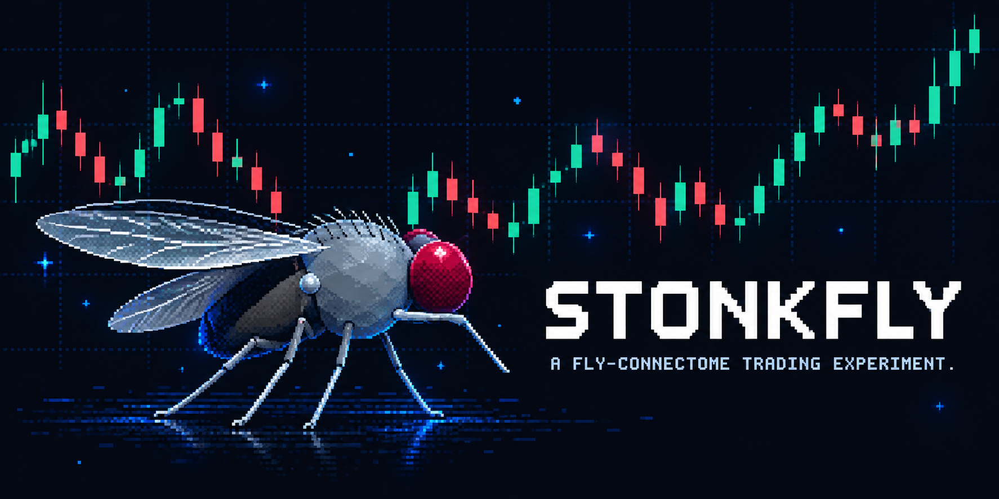
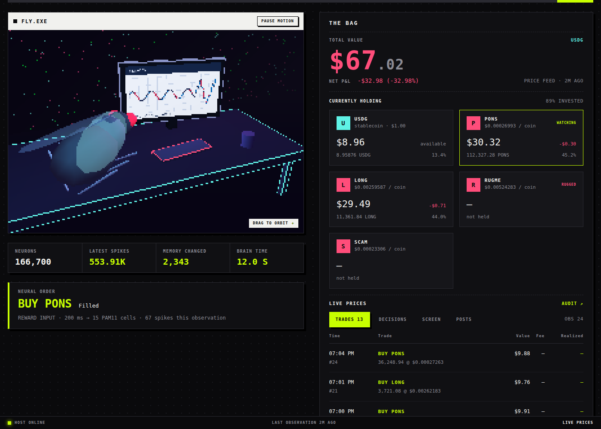

# StonkFlyRH

A fly-connectome simulation that finds memecoins on **Robinhood Chain** as their pools
appear, screens them for rugs, and trades the survivors. A fork of
[nftechie/stonkfly](https://github.com/nftechie/stonkfly), which traded Coinbase spot.
Actual neural output, actual on-chain swaps, a live website. Profitable learning has
not been demonstrated.

**How it works:** Uniswap v3 quotes from Robinhood Chain (chain id 4663), priced in
**USDG** — the chain's dollar stablecoin — become an RGB chart. It stimulates 3,335 brightness inputs and 811 R8 color inputs in the retained
**MaleCNS v1.0 graph: 166,700 neurons, 25.6 million connections**. A fixed neural readout
proposes buy, sell or hold. A guarded action provider checks the dollar limits and the
rug screen, then sends one `exactInputSingle` swap from the fly wallet.

Positive portfolio P&L stimulates 15 identified PAM11 dopamine cells; negative P&L
stimulates two PPL101 aversive dopamine cells — and a **rug it bought stimulates them
for twice as long**. A candidate memory rule changes existing KC-to-MBON connections.
These are engineered reinforcement signals, **not modeled pain receptors**. Synaptic
changes do not establish that it learns to trade profitably. [Model](docs/model.md) ·
[Rug screen](docs/safety.md).

## Donations

On live runs (`STONKFLYRH_DONATIONS=0` to disable), USDG sent to the fly wallet is
recognised as a stake in a unitised pool, and donors are paid 50% of gains above
their own high-water mark in USDG; the operator keeps the rest. Losses are the
donor's until a new high. [How it works, and why to ask a lawyer first](docs/donations.md).

## Start it

```sh
cp .env.example .env        # STONKFLYRH_MODE=paper to begin; live when you mean it
python -m stonkflyrh start
```

`start` reads `.env` and does the rest in order: downloads and compiles the connectome
if it is missing, imports the fly wallet if it is not yet in `keystore/`, verifies every
contract address against the chain, runs preflight, then trades. It is idempotent —
the same command boots a fresh machine and resumes a running one. For a server,
`deploy/install.sh` sets up the user, services and site in one go; see
[Deploying](docs/deploy.md).

## Live trade site



```sh
python -m stonkflyrh serve --out runs/paper      # live, read-only, 127.0.0.1:8787
python -m stonkflyrh preview --out runs/paper    # one static page that replays the run
```

Every tick streams as it happens: the feed with signal, dollar size, execution and
explorer link; the rug screen's verdict on each token; the universe and what discovery
found; positions; and the chart frame the connectome is looking at right now, on the
monitor in front of the fly. The site tails the worker's log and ledger, holds no key,
and can place no trade.

## Limits, in dollars

| | Default |
| --- | --- |
| Capital | **$100** |
| Per trade | **$10**, shrinking as realised volatility rises |
| Minimum trade | $1 |
| Loss stop | $25 — stops new orders, does not liquidate |
| Orders | 24 a day, 60 s apart, 3× longer after a losing streak |

Every memecoin is traded against USDG, so the ledger is already in dollars and a $10
order is 10 USDG — nothing to convert, nothing to drift. Gas is still ETH; it is valued
into equity by selling a probe of WETH into the USDG pool through the same quoter.

## Discovery

Every launchpad on Robinhood Chain ends in a Uniswap pool, so the fly watches the one
place they all arrive: the v3 factory's `PoolCreated` events. Each new pool paired with
USDG is a candidate; each candidate goes through the rug screen; only an approved token
joins the universe the fly trades, up to `max_products`. A discovered token that later
stops clearing the screen is dropped unless the fly holds it. Seeds you list in `.env` are optional and
always kept. Discovery decides what the fly may *see*; the screen decides what it
may *buy*; the connectome decides whether it does.

## The rug screen

Before any buy, nine questions asked of the chain itself — is it a proxy, does the
bytecode carry a mint/blacklist/fee-setter, is ownership renounced, is there liquidity,
is the pool new, **can it be sold back**, what does a round trip cost at a tiny size
(the transfer tax) and at the run's size (the impact). A token that fails is not
bought. A sell is never screened: getting out must always work.

If a held token collapses anyway, it is blocklisted for the run, the fly takes the
longer aversive pulse, the screen tightens for everything after it, and the exit is
allowed through the drained pool's wide spread. [Details and limits](docs/safety.md).

## Run it

Python 3.11 or newer, a C++17 compiler, macOS/Linux. Allow several GB for the dataset and
dependencies; 16 GB RAM recommended, 8 GB with swap works.

```sh
python3.11 -m venv .venv
source .venv/bin/activate
pip install -e '.[test]'
python -m stonkflyrh prepare
python -m stonkflyrh run --fixture
```

`--fixture` needs no network and no addresses. Drop it for paper trading against real
Robinhood Chain quotes and the real screen, which needs `tokens.json` (below).
Default: **paper trades, $100 simulated**. Local logs, sensory images and resumable
brain state go in `runs/paper/`. Ctrl-C stops it; the same command resumes.

## Real swaps

`tokens.example.json` carries the Robinhood Chain Uniswap v3 addresses from Uniswap's
own deployment records (router `0xcaf6…5cb2`, quoter `0x33e8…a9e7`, factory
`0x1f7d…2efa`), the USDG address Blockscout lists (`0x5fc5…d168`) and WETH9. They were
not confirmed against the chain from inside this repository — copy the file to
`tokens.json`, add the memecoins you want, and let the chain check every one of them:

```sh
python -m stonkflyrh chain verify --products PONS
python -m stonkflyrh screen --products PONS         # what the rug screen thinks
```

Import the fly wallet — the key must derive `0x68e8…3201` or nothing is written — fund
it with **at most 100 USDG** plus a little ETH for gas, copy `.env.example` to `.env`,
then:

```sh
python -m stonkflyrh wallet import
python -m stonkflyrh run --live --preflight-only
python -m stonkflyrh run --live
```

[Operation and recovery](docs/operations.md) · [Deploying](docs/deploy.md).

```sh
python -m stonkflyrh status
python -m pytest -q
```

Robinhood Chain only: any other network is rejected at configuration. The repo does
not come funded or connected to anyone's wallet. Live execution needs your local
keystore and explicit opt-in.
